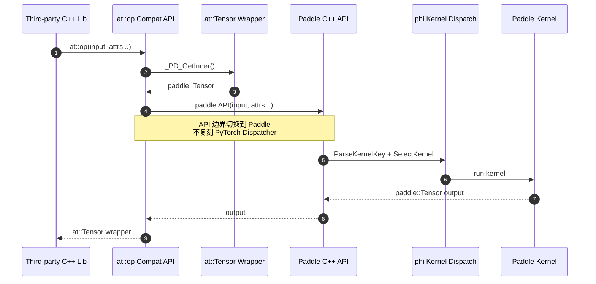
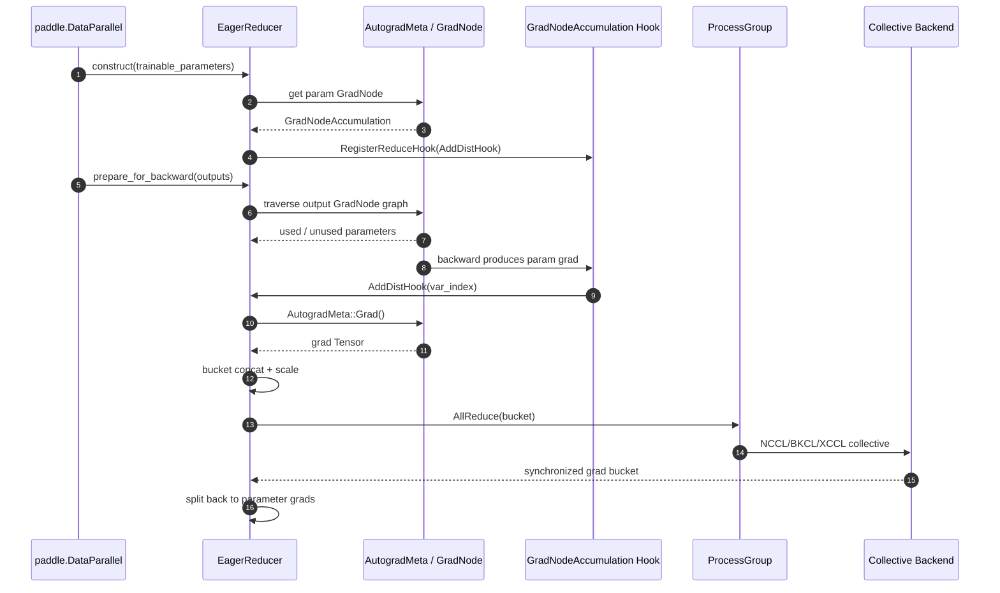

# 00 · 项目背景与总览

## 1. 项目背景

### 1.1 第十期飞桨黑客松护航计划集训营

项目详情见 [PaddlePaddle/Paddle#76977](https://github.com/PaddlePaddle/Paddle/issues/76977) 及 [community/hackathon_10th 项目合集 — 项目四](https://github.com/PaddlePaddle/community/blob/master/hackathon/hackathon_10th/【Hackathon_10th】飞桨护航计划集训营项目合集_提前批.md#项目四PaddleC++API生态兼容建设)。

### 1.2 为什么要做 C++ API 兼容

Paddle 在 Python 层已逐步对齐 PyTorch,但**深度学习编译生态中大量第三方 C++ 库**依赖 **libtorch C++ API**(`ATen` + `c10` + `torch::`)直接编译。如果 Paddle 不提供等价的 C++ API 表面,这些库就只能选择 PyTorch,Paddle 生态被卡在"Python 用户友好但 C++ 集成不友好"。

这些库对 PyTorch 的依赖是**"路径依赖"**而非**"本质依赖"**——它们需要的只是最底层的 C++ tensor 抽象,完全不触及 autograd、nn::Module、optim 等框架高层特性:

| 下游库 | 核心功能 | 框架无关的本质 |
|---|---|---|
| **DeepEP** (hybrid-ep 分支) | MoE all-to-all 通信调度 | 通信库只搬运 GPU 内存块,不关心数据由哪个框架分配 |
| **DeepGEMM** | FP8/INT8 矩阵乘法 kernel | 全部 CUDA PTX 模板自包含,框架仅提供"用什么类型"的枚举 |
| **FlashMLA** | 高效多头注意力计算 | IO-aware tiling 算法在 SRAM 内完成,框架只负责"把描述符传给 kernel" |
| **paddlecodec** | 视频/音频编解码 | FFmpeg+NVDEC 做实际编解码,框架只是"接出 tensor"的胶水 |

**目标**:在 Paddle 中提供一组与 libtorch ABI 兼容的 C++ 头/源文件,让上述库**无需大改源码**即可重定向到 Paddle。具体策略:

1. 头文件路径与 PyTorch 上游对齐(`ATen/`、`c10/`、`torch/`、`utils/`),下游可以原封 `#include`。
2. 接口签名、命名空间、宏名与 PyTorch 严格一致;实现走 Paddle 的 `phi::GPUContext` / `phi::DenseTensor` / `phi::DataType` 后端。
3. 行为对齐 — 同一份 C++ 测试代码分别链接 Paddle compat 层和 libtorch,输出 `diff` 必须为空。
4. CI 守护 — 在 Paddle 主仓加入 Linux 动态符号 ABI 兼容性检查,防止后续 PR 误删兼容接口。

### 1.3 为什么 dispatch 和 backward 差异可以被兼容层屏蔽

兼容层屏蔽的不是底层机制本身,而是下游库接触到的 C++ API 边界。PyTorch 原生调用会经过 `DispatchKeySet + Dispatcher`,Paddle 原生调用会经过 `ParseKernelKeyByInputArgs + phi::KernelFactory`;两者的 kernel dispatch 机制并不相同。compat 层的关键做法是:在 `at::op/at::Tensor` 入口保持 libtorch 形态,进入实现后立即取出内部 `paddle::Tensor`,后续 kernel 选择交给 Paddle 自己的 dispatch 体系。



因此,`DispatchKeySet + Dispatcher` 的差异可以被屏蔽,是因为第三方库只依赖 `at::op/at::Tensor` 这层表面;一旦进入 compat 入口,真实 kernel 选择已经转交给 Paddle 的 `phi::KernelFactory`。这也解释了为什么 compat 层不需要复刻完整 PyTorch dispatcher:它只需要在 API 形态、Tensor 包装、dtype/device/stream 等可观察行为上对齐,让下游代码能编译并把调用送入 Paddle 运行时。

训练场景下,反向传播同样不是由 compat 层实现一套 PyTorch autograd engine。Paddle 的实际分布式训练链路中,`paddle.DataParallel` 在 forward 后调用 `EagerReducer::PrepareForBackward`,reducer 从 `paddle::Tensor` 的 `AutogradMeta` 中取 `GradNode`,给参数的 `GradNodeAccumulation` 注册 reduce hook;backward 产生参数梯度后,hook 触发 `AddDistHook`,reducer 再从 `AutogradMeta::Grad()` 取梯度,做 bucket concat/scale,最后交给 `ProcessGroup` 完成 allreduce。



所以,训练时能屏蔽 backward 差异的前提是 compat 前向路径产生或保留的是 Paddle 可追踪的 `paddle::Tensor`,并且张量上挂着 Paddle 的 `AutogradMeta/GradNode`。这样后续 backward、梯度 hook、bucket allreduce 都由 `paddle::distributed::EagerReducer` 和 `ProcessGroup` 原生完成,第三方 C++ 算子库不需要感知 Paddle 与 PyTorch 的反向引擎实现差异。

这个边界也必须说清:普通 `at::Tensor/at::op` 调用可以通过上述方式屏蔽差异;如果下游直接依赖 `torch::autograd::Function`、PyTorch dispatcher 注册、autograd key 或自定义 backward 注册,就不能只靠普通 API 映射自动兼容,需要额外适配到 Paddle 自定义 op、Paddle `GradNode` 或等价的训练运行时扩展点。

## 2. 技术架构鸟瞰

### 2.1 Paddle 仓库内 compat 层布局

```
paddle/phi/api/include/compat/
├── ATen/
│   ├── ATen.h, Functions.h, Tensor.h, Device.h, DeviceGuard.h
│   ├── Utils.{h,cpp}, AccumulateType.{h,cpp}, OpMathType.h, TensorIndexing.h
│   ├── core/             # Tensor、TensorBase、TensorAccessor、TensorBody、Generator、Scalar、ivalue、jit_type、function_schema
│   ├── cuda/             # CUDAContext{,Light}、CUDAEvent、CUDABlas、CUDADataType、CUDAGeneratorImpl、PhiloxCudaState、PhiloxUtils、EmptyTensor、Exceptions
│   ├── native/           # RangeUtils、native/cuda/Resize
│   └── ops/              # 50+ 算子的兼容入口(empty/full/zeros/ones/cat/select/split/squeeze/from_blob/...)
├── c10/
│   ├── core/             # ScalarType、SymInt{,ArrayRef}、Storage、Layout、MemoryFormat、Device、DeviceType、DispatchKey{,Set}、Event、Stream、TensorOptions、Backend、Allocator、DefaultDtype、ScalarTypeToTypeMeta、List
│   ├── util/             # TypeMeta (typeid.{h,cpp})、Half、BFloat16、complex、Float8/Float4 系列、qint*、bits、intrusive_ptr、UniqueVoidPtr、ArrayRef、OptionalArrayRef、Optional、Exception (TORCH_WARN)、TypeIndex、accumulate
│   ├── cuda/             # CUDAStream.{h,cpp}、CUDAFunctions.{h,cpp}、CUDAGuard、CUDAException、impl/cuda_cmake_macros
│   └── macros/           # 核心宏 Macros.h
├── torch/
│   ├── csrc/api/include/torch/{torch.h, all.h, sparse.h, version.h, cuda.h, cuda.cpp}
│   ├── csrc/jit/         # JIT 兼容 shim
│   ├── headeronly/       # 纯 header 实现的 DeviceType、ScalarType、TensorAccessor、Exception(便于跨库引用)
│   ├── extension.h
│   └── library.{h,cpp}
└── utils/                # Paddle ↔ libtorch 转换适配
    ├── scalar_type_conversion.h、int_array_ref_conversion.h、dense_sparse_conversion.h
    ├── pinned_place.h、macros.h(STD_CHECK 等)
```

### 2.2 单元测试

- 主仓:[test/cpp/compat/](https://github.com/PaddlePaddle/Paddle/tree/develop/test/cpp/compat) — `c10_*_test.cc`、`ATen_*_test.cc`、`torch/*_test.cc`,与 compat 层目录结构平行。
- 测试仓:[PaddleCppAPITest/test/](https://github.com/PFCCLab/PaddleCppAPITest/tree/develop/test) — 按 `ATen/`、`c10/`、`torch/` 镜像 libtorch 路径,由顶层 CMake `GLOB_RECURSE`,产物对照 libtorch 版执行 `diff`。

### 2.3 ABI 防回退

- Linux:[tools/check_abi_compatibility.py](https://github.com/PaddlePaddle/Paddle/blob/develop/tools/check_abi_compatibility.py) + [ci/static_check.sh](https://github.com/PaddlePaddle/Paddle/blob/develop/ci/static_check.sh) — 通过 `readelf --dyn-syms -W` 比对 base wheel 与 PR wheel 的 `c10::`/`at::`/`torch::`/`caffe2::` 符号,删除即拦截(#78831)。
- 单测:[test/tools/test_check_abi_compatibility.py](https://github.com/PaddlePaddle/Paddle/blob/develop/test/tools/test_check_abi_compatibility.py) 覆盖符号新增、删除、弱/未定义/local 忽略、第三方符号忽略等场景。

## 3. 时间线

> 时间为 UTC。**当月 PR 数 = 当月 createdAt 落在该月的 PR 数**(含全部状态)。

| 月份 | PR 数 | 标志性工作 |
|---|---:|---|
| 2025-12 | 3 | 起步 PR:`Tensor.reset`(#77127 后被替代)、PaddleCppAPITest cmake 修复(#8)、首批测试(#9) |
| **2026-01** | **15** | 基础类型 `Layout`/`Storage`/`ScalarType`/`SymInt`(#77185/#77176/#77303/#77301)、`Tensor.reset` 重交(#77319)、`pointer` API(#77388)、`DispatchKeySet` 探索(#77399/#77416)、`TensorAccessor`(#77498)、`flatten/narrow`(#77544)、`Sparse` 拆解(#77581) |
| 2026-02 | 9 | `select/split`(#77614)、Tensor 方法搬到 `ops/`(#77713)、初版 `torch/torch.h`(#77854)、综合 compat 重构(#78037)、`CUDABlas`/`Generator`/`Philox` 起步(#78060/#78070/#78072) |
| 2026-03 | 12 | `record_stream` + Stream/Event(#78143)、`pin_memory`+`from_blob`(#78255)、`TypeMeta` 替代 `ScalarType`(#78257)、Utils 实现搬迁(#78244)、若干文档 PR(#34、#46、#47、#49、#56) |
| **2026-04** | **22** | 综合对齐密集期:#78484 拆 6 个子 PR(#78549–#78555)、`TORCH_WARN`+`resize_`(#78576)、文件改名清理(#78580)、`ScalarType`/`CUDAContext`/DCU 适配(#78581/#78584/#78595)、`resize_` 存储对齐(#78609/#78633)、`STD_CHECK`(#78641)、XPU 测试(#78647)、CUDA Stream ↔ GPUContext 同步(#78652)、headeronly(#78662)、Windows 平台(#78670)、综合对齐 #78707 拆 4 个子 PR(#78806–#78809)、`MaybeResetHolder`(#78826)、Linux ABI CI(#78831) |
| 2026-05 | 2 | 收尾:`Align some other APIs`(#78837 拆自 #78707)、`use thread-local stream`(#78902 - 修复 #78652 的多线程语义)、测试仓 `compile-test` 自动化(#60) |

**峰值期**:**2026 年 4 月**贡献 22 个 PR(平均每 1.3 天一个),覆盖了整个工程的关键收口工作。

## 4. PR 状态总览

| 仓库 | 全部 | MERGED | OPEN | CLOSED |
|---|---:|---:|---:|---:|
| Paddle(`[Cpp API Compatibility]` 前缀) | 63 | 50 | 9 | 7 |
| Paddle(同期其他相关) | 3 | 2 | 1 | 0 |
| PaddleCppAPITest | 31 | 25 | 6 | 0 |
| **合计** | **97** | **75** | **15** | **7** |

未合入 PR 的语义:

- **CLOSED**(7 个)全部是**被后续 PR 拆解或替代**,无功能性遗失;详见 [`05-未合并PR分析.md`](05-未合并PR分析.md)。
- **OPEN**(9 个)分别是:
  - **Paddle 主仓(6 个)**:
    - [#77399](https://github.com/PaddlePaddle/Paddle/pull/77399) `DispatchKeySet` API — 设计争议,等待最终方案。
    - [#77694](https://github.com/PaddlePaddle/Paddle/pull/77694) FA 编译线程数调优 — 非阻塞性优化建议。
    - [#78902](https://github.com/PaddlePaddle/Paddle/pull/78902) `getCurrentCUDAStream` 改回 thread-local — 修复 #78652 的多线程 SegFault,正在 review 中。
    - [#79173](https://github.com/PaddlePaddle/Paddle/pull/79173) `broadcast_to` compat interface — 2026-05-28 新提,review 中。
    - [#79175](https://github.com/PaddlePaddle/Paddle/pull/79175) `vstack` compat interface — 2026-05-28 新提,review 中。
    - [#79176](https://github.com/PaddlePaddle/Paddle/pull/79176) `column_stack` compat interface — 2026-05-28 新提,review 中。
    - [#79178](https://github.com/PaddlePaddle/Paddle/pull/79178) `take` compat interface — 2026-05-28 新提,review 中。
    - [#79187](https://github.com/PaddlePaddle/Paddle/pull/79187) `svd` — 2026-05-29 新提,review 中。
    - [#79189](https://github.com/PaddlePaddle/Paddle/pull/79189) `Tensor::repeat_interleave` — 2026-05-29 新提,review 中。
  - **PaddleCppAPITest(6 个)**:
    - [#62](https://github.com/PFCCLab/PaddleCppAPITest/pull/62) skill 文档(Step 0/7) — 2026-05-19 新提,review 中。
    - [#64](https://github.com/PFCCLab/PaddleCppAPITest/pull/64) `broadcast_to` cross-framework test — 2026-05-28 新提,review 中。
    - [#65](https://github.com/PFCCLab/PaddleCppAPITest/pull/65) `vstack` test — 2026-05-28 新提,review 中。
    - [#66](https://github.com/PFCCLab/PaddleCppAPITest/pull/66) `take` test — 2026-05-28 新提,review 中。
    - [#67](https://github.com/PFCCLab/PaddleCppAPITest/pull/67) `svd` test — 2026-05-29 新提,review 中。
    - [#68](https://github.com/PFCCLab/PaddleCppAPITest/pull/68) `repeat_interleave` test — 2026-05-29 新提,review 中。

## 5. 关键下游用户

兼容工作以**真实下游编译**为牵引,具体包括(按提及顺序):

| 下游项目 | 触发的 PR | 兼容点 |
|---|---|---|
| **DeepEP(hybrid-ep 分支)** | [#77854](https://github.com/PaddlePaddle/Paddle/pull/77854) | `torch/torch.h` 入口头 |
| **DeepEP** | [#78143](https://github.com/PaddlePaddle/Paddle/pull/78143)、[#78576](https://github.com/PaddlePaddle/Paddle/pull/78576)、[#78584](https://github.com/PaddlePaddle/Paddle/pull/78584)、[#78549](https://github.com/PaddlePaddle/Paddle/pull/78549) | `record_stream`、`TORCH_WARN`、`CUDAContext.h`、`Stream`、`Event` |
| **DeepGEMM** | [#78484](https://github.com/PaddlePaddle/Paddle/pull/78484)→#78552/#78554/#78555 | `arange` 默认 dtype、`resize_`、`CUDAStream` 优先级 |
| **FlashMLA** | [#78484](https://github.com/PaddlePaddle/Paddle/pull/78484)→#78550 | `at::cuda::is_available()` redefinition |
| **FastDeploy** | [#78652](https://github.com/PaddlePaddle/Paddle/pull/78652)、[#78902](https://github.com/PaddlePaddle/Paddle/pull/78902) | `getCurrentCUDAStream` ↔ `phi::GPUContext` 双向同步 |
| **paddlecodec** | [#78641](https://github.com/PaddlePaddle/Paddle/pull/78641) | `STD_CHECK` 宏 |
| **DCU 设备** | [#78595](https://github.com/PaddlePaddle/Paddle/pull/78595) | HIP native APIs 替代 CUDA native APIs |
| **XPU 设备** | [#78647](https://github.com/PaddlePaddle/Paddle/pull/78647) | XPU device 索引解析 |
| **Windows 用户** | [#78670](https://github.com/PaddlePaddle/Paddle/pull/78670) | 符号导出、`PADDLE_API`、`ERROR` 宏污染 |

## 6. 自动化与 Skill 体系

在 PaddleCppAPITest 中沉淀了 4 个 Agent skill(`.claude/skills/` / `.github/skills/`),作为新营员和 LLM 助手做 compat 工作的标准操作流程:

| Skill | 作用 |
|---|---|
| `compatibility-testing` | 测试用例编写规范、`diff` 对照工作流(由 @Le-soleile #38 创建,youge325 #9、#40、#60 中迭代) |
| `add-compat-api` | 新增 compat API 的标准步骤、`Step3-1.md`/`Step3-2.md` 子步骤(#59 引入) |
| `fix-compat-api` | 修复已有 compat API 的标准步骤(#59 引入) |
| `compat-doc-authoring` | 编写 compat 文档与 `mismatch_api_record.md` 的规范(#46 引入,#58、#59 迭代) |

并通过 GitHub Actions(`.github/workflows/compile-test.yml`,#59)落地了**自动编译 + diff 比对**的 CI(#60 进一步把 `PADDLE_WITH_CUSTOM_KERNEL` 路径打进 CI)。

## 7. 接下来要读

- 起步与基础类型对齐 → [01-基础类型与Tensor/](01-基础类型与Tensor/README.md)
- CUDA 流/事件/设备适配的硬核工程 → [02-CUDA与设备/](02-CUDA与设备/README.md)
- 整个 compat 层的工程治理(入口、宏、CI、改名)→ [03-接口结构与基础设施/](03-接口结构与基础设施/README.md)
- PaddleCppAPITest 仓库的全部贡献 → [04-PaddleCppAPITest仓库/](04-PaddleCppAPITest仓库/README.md)
- 5 个 CLOSED + 3 个 OPEN 的来龙去脉 → [05-未合并PR分析.md](05-未合并PR分析.md)
- 80 个 PR 的总账 → [06-完整PR列表.md](06-完整PR列表.md)
